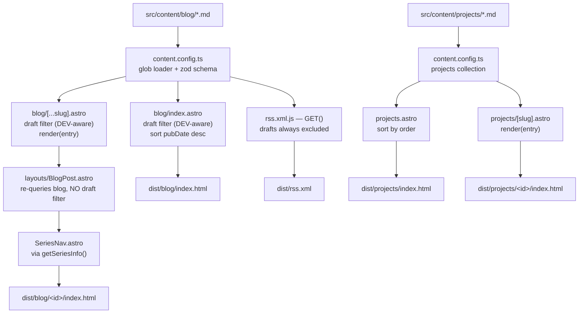

# Pieter de Jong - Personal website

Live at: https://padj.vercel.app/

**This is my main online presence**, aside from [my LinkedIn](https://www.linkedin.com/in/pieteradejong/) and [my GitHub](https://github.com/pieteradejong). The Internet is a large place, and standing out is both critical and hard. This is where I aim to do so.

# Goals
* Marketing: put myself out there.
* Connect: Find like-minded, share ideas, potentially work together, etc.

# Website 'Table of contents':

* Blog - I like to write
* About Me - Personal background, history, what sets me apart from the crowd.
* Reading: I love to read, and seek out fellow readers.
* Contact: self-evident.


# Maintenance / deployment
Built with [Astro](https://astro.build) and hosted on [Vercel](https://vercel.com). `npm run dev` serves the site on `localhost` with live reload; pushing to `main` deploys it. See [Deployment](#deployment).

# TODO 
Stuff I would like to add in the future:
* Top priorities: content, quality, and loading speed.
* auto translate to any language, especially Spanish and Dutch. Classic Latin and Classic Greek would be cool too.
* Low-friction contact methods.
* Inline programming code, e.g. `Python`.
* If/when my content becomes good enough, a micro-payment "tip jar".

# Astro Blog

A modern, fast blog built with Astro.js featuring static search capabilities.

## Features

- 🚀 Built with Astro.js for optimal performance
- 📝 Markdown and MDX support
- 🔍 Static search functionality with Pagefind
- 📱 Responsive design
- 🎨 Clean, professional styling
- 📊 LaTeX support for mathematical content
- 🔄 Easy deployment with included scripts

## Quick Start

1. Clone the repository:
```bash
git clone https://github.com/yourusername/astropieter.git
cd astropieter
```

2. Run the initialization script:
```bash
chmod +x init.sh
./init.sh
```

3. Start the development server:
```bash
npm run dev
```

## Local Development

To run the site locally:

1. Make sure you have Node.js 22.12+ installed (required by Astro 6+; see [Upgrade Reqs](#upgrade-reqs))
2. Clone the repository and navigate to it:
```bash
git clone https://github.com/yourusername/astropieter.git
cd astropieter
```

3. Install dependencies:
```bash
npm install
```

4. Start the development server:
```bash
npm run dev
```

The site will be available at `http://localhost:4321` (or another port if 4321 is in use).

Key development commands:
- `npm run dev` - Start development server with hot reloading (Astro 7 runs this as a background daemon — manage it with `npx astro dev status` / `stop` / `logs`)
- `npm run build` - Build the site for production
- `npm run preview` - Preview the production build locally

## Testing

Run `./test.sh` before deploying (`./test.sh --offline` skips the network checks). It covers dependency health (exact pins, installed = declared, no unused packages), the production build, drafts and RSS, KaTeX, theme and contrast, accessibility, SEO, outbound links, and a dev-server smoke test. Exits non-zero on any failure.

Its browser section runs `tests/content.spec.ts` (Playwright, headless Chrome) against the dev server: every Markdown/GFM construct, LaTeX in `.md` and `.mdx`, the KaTeX stylesheet and fonts actually applied, no overflow at phone width, and every blog post free of math errors, leaked LaTeX and console errors. The fixtures are draft posts (`src/content/blog/test-fixture-*`), so they are never built for production. To run the browser tests alone, with a dev server already up:

```bash
BASE_URL=http://localhost:4321 npx playwright test
```

Playwright uses the installed Chrome (set `CHROME_PATH` if it is somewhere unusual); no browser download is needed.

## Writing LaTeX

Inline math: `$E = mc^2$`. Display math needs the `$$` on lines of their own:

```markdown
$$
\int_{-\infty}^{\infty} e^{-x^2}\,dx = \sqrt{\pi}
$$
```

`$$x$$` on a single line renders as *inline* math; `test.sh` fails on it. A literal dollar sign is `\$`. Math works the same in `.mdx` posts.

How it works: `remark-math` finds the math, `rehype-katex` renders it with its own bundled `katex`, and `BaseHead.astro` loads the matching KaTeX stylesheet from jsDelivr. When `rehype-katex` moves to a new katex, `test.sh` fails until the stylesheet URL and its `integrity` hash are updated to match.

## Deployment

Push to `main`: Vercel builds and publishes the site to https://padj.vercel.app. There is no deploy script. Vercel does not run the tests, so run `./test.sh` before pushing, and `./test.sh --live https://padj.vercel.app` afterwards to check what is being served. Rollback, configuration and plan limits: `DEPLOYMENT.md`.

## Project Structure

```
.
├── src/
│   ├── components/       # Reusable components
│   ├── content/          # Content collections: blog/ and projects/ (markdown/MDX)
│   ├── content.config.ts # Content collection schemas (Content Layer API)
│   ├── layouts/          # Page layouts
│   ├── pages/            # Astro pages
│   └── styles/           # Global styles
├── public/               # Static assets
├── init.sh               # Initialization script
├── test.sh               # Comprehensive pre-deploy test suite
├── tests/                # Playwright browser tests (content rendering)
├── playwright.config.ts  # Playwright config (uses installed Chrome)
├── DEPLOYMENT.md          # Vercel hosting, rollback, limits
└── DECISIONS.md           # Decision log (why Vercel, …)
```

## Content Pipeline

How a markdown file becomes a page. `entry.id` is the slugified filename, so `LaTeX_test.md` becomes `/blog/latex_test/`.



### Known inconsistency: draft filtering

The `draft` flag is honoured in three different ways, which is worth knowing before adding a fourth consumer:

| Consumer | Behaviour |
|---|---|
| `blog/index.astro`, `blog/[...slug].astro` | DEV-aware — drafts visible in `astro dev`, excluded from the production build |
| `rss.xml.js` | always excludes drafts, in dev and prod alike |
| `layouts/BlogPost.astro` | **no draft filter at all** |

`BlogPost.astro` re-queries the whole `blog` collection to build series navigation, so `SeriesNav` prev/next links can point at draft posts that have no generated page in production. Not currently fixed — recorded here so it isn't rediscovered from scratch.

## Upgrade Reqs

Requirements/notes for upgrading Astro across major versions (last reviewed: Astro 5 → 7, Aug 2026):

- **Node 22.12+** required starting in Astro v6 (drops Node 18/20 support)
- **Env vars**: `import.meta.env` values are always inlined and no longer type-coerced (Astro v6); private env vars must be read via `process.env` explicitly
- **Images**: default image service crops by default and never upscales (Astro v6)
- **Routing**: file-extension endpoints can't be accessed with a trailing slash (Astro v6)
- **Removed in v6**: legacy Content Collections API (v2 format), `Astro.glob()`, `<ViewTransitions />` (use `<ClientRouter />`), CJS config files
- **Deprecated in v6**: `Astro` global in `getStaticPaths()`, `astro:schema` import (use `astro/zod`), session driver strings
- **Dependency bumps in v6**: Vite 7, Zod 4 (`z.email()` instead of `z.string().email()`), Shiki 4
- **New Rust-based compiler in v7**: stricter HTML — unclosed tags now error, invalid HTML no longer auto-corrected. Audit `.md`/`.mdx` content for malformed tags.
- **Whitespace in v7**: `compressHTML` default changed from `true` to `'jsx'`, affecting spacing between inline elements
- **Vite 8** upgrade in v7 — check custom plugins/config for compatibility
- **Markdown in v7**: new "Sätteri" pipeline replaces remark/rehype by default. This project uses `remark-math` + `rehype-katex` for LaTeX — install `@astrojs/markdown-remark` to keep the remark/rehype pipeline working
- **`@astrojs/db` removed** entirely in v7 (not used in this project)

Recommended upgrade path: run `npx @astrojs/upgrade` to update Astro and official integrations together, then fix any compiler errors surfaced during build.

## Changelog

### Dependency refresh and content tests (Sep 2026)

- **Upgraded** `astro` 7.3.1 → 7.3.5, `@astrojs/mdx` 8.0.0 → 8.0.2, `@astrojs/markdown-remark` 7.3.0 → 7.3.1. Every dependency is now pinned exactly (no `^`).
- **Removed unused `katex` and `@astrojs/react`** — nothing imported either; math is rendered by `rehype-katex`'s own bundled katex.
- **KaTeX stylesheet fixed** — `BaseHead.astro` loaded the katex 0.15.1 stylesheet while math was rendered by 0.16.47. Now matched, with a verified SRI hash.
- **Display math fixed** in `LaTeX_test.md` and the information-theory draft: single-line `$$…$$` had been rendering inline.
- **Removed the `chrome-bookmarks` GitHub link** — the repo is private, so visitors got a 404.
- **Added Playwright browser tests** (`tests/content.spec.ts`) and stronger dependency, math-pipeline and fixture-leak checks in `test.sh`.

### Astro 5 → 7 upgrade (Aug 2026)

Upgraded the site from Astro 5.15.5 to 7.2.2 via `npx @astrojs/upgrade`, then resolved every breaking change it surfaced:

- **Removed `@astrojs/tailwind`** — it was an unused dependency (never imported in `astro.config.mjs`, no Tailwind config or `@tailwind` usage anywhere) and the sole blocker preventing `npm install` from resolving cleanly against Astro 7.
- **Content collections migrated to the Content Layer API** — moved `src/content/config.ts` → `src/content.config.ts`, added `glob()` loaders per collection (`astro/loaders`), switched schema imports to `astro/zod`. The legacy config format was hard-removed in Astro v6.
- **`entry.slug` → `entry.id`, `entry.render()` → `render(entry)`** — Content Layer API entries no longer expose `.slug` or a `.render()` method. Updated every usage across blog/project detail pages, `rss.xml.js`, `blog/index.astro`, `projects.astro`, `BlogPost.astro`, `SeriesNav.astro`, and `utils/series.ts`.
- **Markdown pipeline** — moved `remarkPlugins`/`rehypePlugins` (used for KaTeX via `remark-math` + `rehype-katex`) into `unified({...})` from the new `@astrojs/markdown-remark` package, since Astro v7 replaced the default markdown pipeline.
- **CSS media queries fixed** — `@media (max-width: var(--mobile-cutoff))` and similar are invalid CSS (custom properties aren't allowed in media-query conditions). The stricter LightningCSS minifier bundled with Astro 7 now hard-fails the build on this instead of silently ignoring it. Replaced with literal breakpoint values (`375px`, `768px`) in `global.css` and 6 components — this also fixed several responsive breakpoints that were silently dead before (the media queries never matched anything).
- **`rss.xml.js` fixed** — the endpoint handler was `export function get()` (lowercase), which Astro no longer recognizes as a route handler (must be `GET`); the feed was silently broken. Also added draft-post filtering to the feed, since drafts were leaking into RSS even though they were correctly excluded from the blog index.
- **`npm audit fix`** — resolved a moderate (`mdast-util-to-hast`) and a high (`sharp`/libvips) vulnerability pulled in transitively by the upgraded packages. 0 vulnerabilities remain.
- **Local pre-commit hook fixed** (`.git/hooks/pre-commit`, not tracked in git) — it used to `grep` staged filenames for the substring `deploy.sh`, which false-positived on deleting `deploy.sh` from tracking and on unrelated files like `deploy.sh.example`. Rewrote it to exact-match filenames and to only check added/modified files, not deletions.
- **Added `test.sh`** — a comprehensive test suite covering: Node/dependency health, `npm audit`, production build correctness (no errors/warnings), presence of every expected page, correct draft-post inclusion/exclusion, RSS feed validity (well-formed XML, no drafts, no `undefined` fields), KaTeX rendering, and a live dev-server smoke test across all main routes (Astro 7's `astro dev` now self-daemonizes in the background, managed via `astro dev status`/`stop`/`logs` — the script accounts for this).
- **Deploy script separated from templates** — `deploy.sh` (real SSH credentials) is now gitignored and kept local-only; `deploy.sh.example`, `.deploy-env.example`, and `DEPLOYMENT.md` are the checked-in, credential-free templates.

Verified with a clean `npm run build`, `./test.sh` (52/52 checks passing), and manual route checks in both dev and production builds.

## Customization

### Styling

All styles use CSS variables defined in `src/styles/global.css`. Key variables:
- `--accent`: Primary accent color (used for links)
- `--non-link-text`: Color for non-interactive text
- `--card-bg`: Background color for cards
- `--border`: Border color
- `--mobile-cutoff`: Breakpoint for mobile devices

## Contributing

1. Fork the repository
2. Create your feature branch
3. Commit your changes
4. Push to the branch
5. Create a Pull Request

## License

MIT License - see LICENSE file for details
